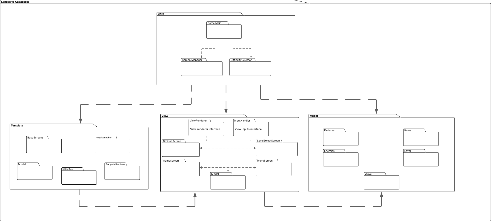

# 4.1 Documento de Arquitetura de  Software (DAS)

## Introdução
Este Documento de Arquitetura de Software apresenta uma visão geral abrangente da estrutura e organização do sistema, descrevendo seus principais componentes, seus relacionamentos e as decisões arquiteturais que orientam o desenvolvimento. Ele serve como referência central para todos os envolvidos no projeto, garantindo entendimento comum sobre como o sistema foi projetado e como deverá evoluir ao longo do seu ciclo de vida.

A introdução oferece o contexto necessário para compreender o documento, incluindo sua finalidade, escopo, termos relevantes e organização geral. Com isso, estabelece a base para uma comunicação clara entre analistas, arquitetos, desenvolvedores, testadores e demais stakeholders.

### Propósito
O objetivo deste documento é capturar, comunicar e justificar as decisões arquiteturais essenciais do sistema. Por meio de diferentes visões arquiteturais — como lógica, processos, implantação e implementação — ele descreve como o sistema será estruturado para atender aos requisitos funcionais e não funcionais.

Este documento guia equipes técnicas durante o desenvolvimento, manutenção e evolução da solução, oferecendo:

- Um entendimento consistente e compartilhado sobre a arquitetura.

- Diretrizes para implementação, padrões e restrições.

- Visibilidade sobre decisões críticas que impactam desempenho, segurança, escalabilidade e qualidade geral do sistema.

Suporte ao planejamento, estimativas e integração entre equipes.

Destina-se a arquitetos, desenvolvedores, engenheiros de infraestrutura, analistas e demais partes interessadas que necessitam compreender como o sistema foi projetado ou como deverá ser expandido no futuro.

### Escopo
O presente documento se aplica ao desenvolvimento de um jogo Tower Defense, inspirado no estilo Plants vs Zombies, com temática do folclore brasileiro. O sistema abrangerá os seguintes recursos principais:

- Menu de Tela Inicial: ponto de entrada do jogador, contendo opções de navegação.

- Seleção de Mapas: escolha do cenário em que a partida será realizada.

- Seleção de Dificuldade: definição do nível de desafio da partida.

- Loja de Personagens: espaço para aquisição de personagens utilizando recursos do jogo.

- Escolha de Personagens para Partida: seleção estratégica dos personagens que participarão do combate.

- Configurações de Áudio: ajustes de música e efeitos sonoros.

O objetivo principal do jogo é sobreviver até o final da onda de inimigos, utilizando estratégias e personagens adquiridos na loja para defender o mapa.

### Definição, Acrônimos, e Abreviações
Esta seção apresenta os termos, acrônimos e abreviações utilizados no documento, garantindo entendimento consistente entre todos os leitores.

**Definições**

- **Jogo Tower Defense**: gênero de jogo em que o jogador deve impedir que inimigos alcancem um objetivo, posicionando unidades defensivas estrategicamente.

**Orda**: conjunto de inimigos que avança em sequência durante a partida.

**Personagem**: unidade jogável ou defensiva que possui habilidades específicas para combater os inimigos.

**Mapa**: cenário do jogo onde ocorre a partida.

**Loja**: funcionalidade do jogo que permite ao jogador adquirir personagens ou recursos utilizando moedas ou pontos do jogo.

**Dificuldade**: nível de desafio da partida, que pode influenciar a quantidade e força dos inimigos.

Acrônimos

<!-- 
**UC**: User Interface (Interface do Usuário)

**XP**: Experience Points (Pontos de Experiência)

**HP**: Health Points (Pontos de Vida)

Abreviaturas

**Lvl**: Level (Nível)

**Cf**: Configuração -->

## Visão Geral

Esta seção fornece uma visão geral do sistema e da estrutura deste documento de arquitetura, explicando como as informações estão organizadas e como devem ser interpretadas pelos leitores.

O sistema é um jogo Tower Defense com temática do folclore brasileiro, inspirado no estilo Plants vs Zombies. O jogador deve sobreviver às ondas de inimigos, utilizando personagens estratégicos adquiridos na loja e escolhidos para a partida, enfrentando diferentes mapas e níveis de dificuldade.

O documento está organizado em seções que representam diferentes visões arquiteturais do sistema:

- **Arquitetura e Representação**: descreve como a arquitetura do software é representada e quais modelos serão utilizados.

- **Objetivos e Restrições Arquiteturais**: apresenta requisitos e restrições que influenciam diretamente a arquitetura do sistema.

- **Use-Case View**: detalha os casos de uso principais, mostrando a funcionalidade central do jogo.

- **Logical View**: descreve a decomposição do sistema em subsistemas, pacotes e classes significativas.

- **Process View**: detalha os processos do sistema e a forma como interagem entre si.

- **Deployment View**: mostra a configuração física de hardware onde o software será executado.

- **Implementation View**: apresenta a estrutura de implementação, incluindo camadas e componentes do sistema.

- **Data View (opcional)**: descreve a perspectiva de armazenamento persistente de dados, caso aplicável.

- **Tamanho, Desempenho e Qualidade**: define os principais parâmetros de dimensionamento, desempenho e atributos de qualidade do sistema.

Esta organização permite que diferentes stakeholders (arquitetos, desenvolvedores, testadores e gerentes) compreendam o sistema de acordo com suas necessidades, facilitando tomada de decisão, manutenção e evolução do jogo.

---

## Architectural Representation
*This section describes what software architecture is for the current system, and how it is represented. Of the Use-Case, Logical, Process, Deployment, and Implementation Views, it enumerates the views that are necessary, and for each view, explains what types of model elements it contains.*

## Architectural Goals and Constraints
*This section describes the software requirements and objectives that have some significant impact on the architecture; for example, safety, security, privacy, use of an off-the-shelf product, portability, distribution, and reuse. It also captures the special constraints that may apply: design and implementation strategy, development tools, team structure, schedule, legacy code, and so on.*

---

## Use-Case View
*This section lists use cases or scenarios from the use-case model if they represent some significant, central functionality of the final system, or if they have a large architectural coverage—they exercise many architectural elements or if they stress or illustrate a specific, delicate point of the architecture.*

### Use-Case Realizations
*This section illustrates how the software actually works by giving a few selected use-case (or scenario) realizations, and explains how the various design model elements contribute to their functionality.*

---

## Logical View

[Ver diagrama no Lucidchart](https://lucid.app/lucidchart/be7a1922-e575-4671-89e9-462b6a013c2f/edit?viewport_loc=-2145%2C-1045%2C4810%2C2701%2C0_0&invitationId=inv_a4c33e9d-48df-4e0b-ab72-471d041ad7b3)

### Overview

O sistema está decomposto em cinco pacotes principais que seguem uma arquitetura em camadas:

1. **Core**: Camada central que gerencia o fluxo principal do jogo e a coordenação entre componentes.

2. **View**: Camada de apresentação responsável pela renderização visual e interface com o usuário.

3. **Model**: Camada de domínio contendo as entidades e lógica de negócio do jogo.

4. **Template**: Camada de recursos reutilizáveis que fornece componentes visuais padronizados.

A organização segue o princípio de separação de responsabilidades, onde cada camada possui um papel bem definido e se comunica com as demais através de interfaces estabelecidas.

### Architecturally Significant Design Packages
*For each significant package, include a subsection with its name, its brief description, and a diagram with all significant classes and packages contained within the package.*

*For each significant class in the package, include its name, brief description, and, optionally, a description of some of its major responsibilities, operations, and attributes.*

<!-- ---

## Process View
*This section describes the system's decomposition into lightweight processes (single threads of control) and heavyweight processes (groupings of lightweight processes). Organize the section by groups of processes that communicate or interact. Describe the main modes of communication between processes, such as message passing, interrupts, and rendezvous.*

---

## Deployment View
*This section describes one or more physical network (hardware) configurations on which the software is deployed and run. It is a view of the Deployment Model. At a minimum for each configuration it should indicate the physical nodes (computers, CPUs) that execute the software and their interconnections (bus, LAN, point-to-point, and so on.) Also include a mapping of the processes of the Process View onto the physical nodes.*

---

## Implementation View
*This section describes the overall structure of the implementation model, the decomposition of the software into layers and subsystems in the implementation model, and any architecturally significant components.*

### Overview
*This subsection names and defines the various layers and their contents, the rules that govern the inclusion to a given layer, and the boundaries between layers. Include a component diagram that shows the relations between layers.*

### Layers
*For each layer, include a subsection with its name, an enumeration of the subsystems located in the layer, and a component diagram.*

---

## Data View (optional)
*A description of the persistent data storage perspective of the system. This section is optional if there is little or no persistent data, or the translation between the Design Model and the Data Model is trivial.*

--- -->

## Size and Performance
*A description of the major dimensioning characteristics of the software that impact the architecture, as well as the target performance constraints.*

---

## Quality
*A description of how the software architecture contributes to all capabilities (other than functionality) of the system: extensibility, reliability, portability, and so on. If these characteristics have special significance, such as safety, security or privacy implications, they must be clearly delineated.*

### Referências
G1. Modelagem. Disponível em: https://unbarqdsw2025-2-turma01.github.io/2025.2-T01-G1_JogoDigital_Entrega_02/Modelagem/2.Modelagem/
. Acesso em: 20 nov. 2025.

SERRANO, Milene. Software Architecture Document. Disponível em: https://aprender3.unb.br/pluginfile.php/3178407/mod_page/content/1/Software%20Architecture%20Document.doc
. Acesso em: 20 nov. 2025.