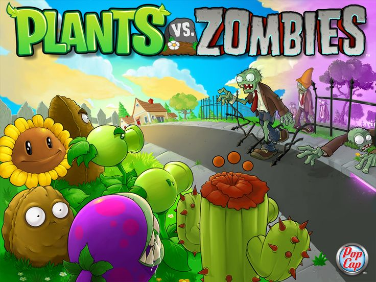

# Apresentação do projeto

## Introdução
<!-- 

 -->

Este projeto se trada da **Entrega 04** desenvolvido pelo **Grupo 01** da disciplina **Arquitetura e Desenho de Software (FGA0208)**, ministrada pela professora **Milene Serrano**.  

A proposta consiste na criação de um **jogo digital do gênero *tower defense***, inspirado em títulos consagrados como *Plantas vs. Zumbis*, no qual o jogador deve utilizar estratégias de defesa para proteger sua base contra ondas sucessivas de inimigos.  

Fonte: <a href="https://br.pinterest.com/pin/229824387204174281/">Pinterest</a>, 2025.

Diferencialmente, este projeto incorpora a **temática do folclore brasileiro**, trazendo personagens, criaturas e elementos culturais nacionais para dentro da experiência de jogo. Entidades protetoras do folclore, como **Curupira, Saci e Iara**, assumem o papel de defensores, enquanto figuras como **Boitatá, Cuca e Mapinguari** se apresentam como inimigos desafiadores.  

Fonte: [Maria Eduarda](https://github.com/dudaa28) 2025.

Dessa forma, além de proporcionar entretenimento, o jogo busca **valorizar a cultura popular brasileira**, promovendo uma experiência lúdica, educativa e ao mesmo tempo estratégica, que conecta a tradição oral do folclore com a tecnologia digital e o design de software.  

A organização do projeto foi feita de forma colaborativa, onde os integrantes da equipe de desenvolvimento e de produção se reuniram para discutir e elaborar o projeto. Por meio da ferramenta *Trello* conseguimos organizar as tarefas e o trabalho em cada etapa do desenvolvimento, o que permitiu uma melhor organização e uma maior eficiência na produção. Tasks e Organização presentes [AQUI](https://trello.com/invite/b/68c89e7d245d3e119563e78b/ATTI0f1277a1b1d06c34e8f57debd7ed65012EE75DDD/arquitetura-de-software).

## Há algo a ser executado?

(**X**) SIM

() NÃO

## Informações Complementares 

>> Quaisquer outras informações adicionais podem ser descritas nessa seção.

## Integrantes

<table align="center">
  <tr>
    <td align="center">
       
      <b><a href="https://github.com/caioduart3">Caio Duarte</a></b> 
    </td>
    <td align="center">
       
      <b><a href="https://github.com/danielle-soaress">Danielle Soares</a></b> 
    </td>
    <td align="center">
       
      <b><a href="https://github.com/EnzoEmir">Enzo Emir</a></b> 
    </td>
    <td align="center">
       
      <b><a href="https://github.com/felixlaryssa">Laryssa Félix</a></b> 
    </td>
    <td align="center">
       
      <b><a href="https://github.com/Leticia-Arisa-K-Higa">Leticia Arisa</a></b> 
    </td>
    <td align="center">
       
      <b><a href="https://github.com/MM4k">Marcelo Makoto</a></b> 
    </td>
  </tr>
  <tr>
    <td align="center">
       
      <b><a href="https://github.com/dudaa28">Maria Eduarda</a></b> 
    </td>
    <td align="center">
       
      <b><a href="https://github.com/VictorPontual">Victor Pontual</a></b> 
    </td>
    <td align="center">
       
      <b><a href="https://github.com/RafaelSchadt">Rafael Welz</a></b> 
    </td>
  </tr>
</table>

## Histórico de versões

Tabela 1: Histórico de versões

| Versão |Descrição     |Autor                                       |Data    |Revisor|
|:-:     | :-:          | :-:                                        | :-:        |:-:|
|1.0     |Criação do documento| [Enzo Emir](https://github.com/EnzoEmir)| 19/11/2025 | -||

Fonte: [Caio Duarte](https://github.com/caioduart3), [Danielle Soares](https://github.com/danielle-soaress), [Enzo Emir](https://github.com/EnzoEmir), [Laryssa Félix](https://github.com/felixlaryssa), [Letícia Arisa](https://github.com/Leticia-Arisa-K-Higa), [Marcelo Makoto](https://github.com/MM4k), [Maria Eduarda](https://github.com/dudaa28), [Victor Pontual](https://github.com/VictorPontual) e [Rafael Welz](https://github.com/RafaelSchadt) 2025.
 